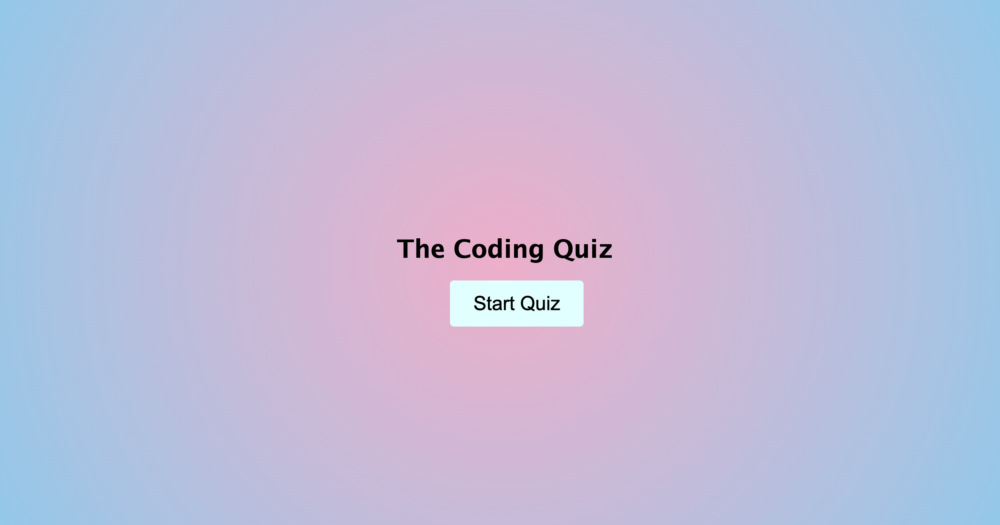

# Coding-Quiz

This week's homework where we had to create a multiple-choice quiz using what we'd learned previously in HTML, CSS, and Javascript. 

# Usage 

<a href="https://hayleymchugh.github.io/coding-quiz/">Deployed Quiz</a>

<a href="https://github.com/HayleyMcHugh/coding-quiz.git">Github</a>
